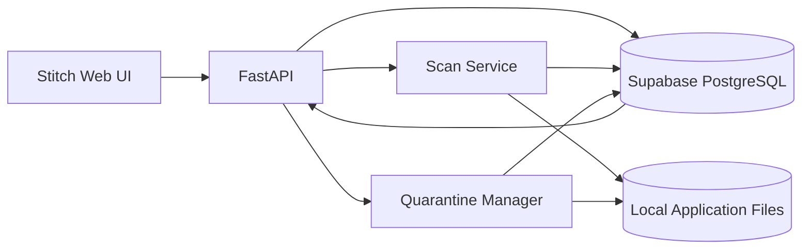

# ARCHITECTURE.md — JP-001

## 1. System Flow



**Principle:** deterministic content hashing and rule evaluation are the source of truth; AI/external services are optional.

## 2. Database Schema — Supabase PostgreSQL

```sql
create extension if not exists pgcrypto;

create table scan_jobs (
  id uuid primary key default gen_random_uuid(),
  status text not null check (status in ('queued','running','completed','failed','cancelled')),
  roots jsonb not null,
  files_seen bigint default 0,
  apps_found int default 0,
  duplicates_found int default 0,
  error_count int default 0,
  started_at timestamptz,
  completed_at timestamptz,
  error_message text,
  created_at timestamptz default now()
);

create table applications (
  id uuid primary key default gen_random_uuid(),
  scan_job_id uuid references scan_jobs(id) on delete cascade,
  name text not null,
  path text not null,
  category text,
  metadata jsonb default '{}',
  content_fingerprint text not null,
  total_size bigint default 0,
  file_count int default 0,
  created_at timestamptz default now(),
  unique(scan_job_id, path)
);

create index applications_fingerprint_idx
  on applications(content_fingerprint);

create table app_files (
  id uuid primary key default gen_random_uuid(),
  application_id uuid references applications(id) on delete cascade,
  relative_path text not null,
  size bigint not null,
  sha256 text not null,
  unique(application_id, relative_path)
);

create table duplicate_groups (
  id uuid primary key default gen_random_uuid(),
  fingerprint text unique not null,
  created_at timestamptz default now()
);

create table duplicate_group_members (
  group_id uuid references duplicate_groups(id) on delete cascade,
  application_id uuid references applications(id) on delete cascade,
  primary key (group_id, application_id)
);

create table categorization_rules (
  id uuid primary key default gen_random_uuid(),
  name text not null,
  priority int default 100,
  enabled boolean default true,
  conditions jsonb not null,
  category text not null,
  created_at timestamptz default now()
);

create table removal_actions (
  id uuid primary key default gen_random_uuid(),
  application_id uuid references applications(id),
  action text not null check (action in ('quarantine','restore')),
  original_path text not null,
  quarantine_path text,
  status text not null check (status in ('pending','completed','failed')),
  error_message text,
  created_at timestamptz default now()
);

create table audit_logs (
  id uuid primary key default gen_random_uuid(),
  action text not null,
  entity_type text not null,
  entity_id uuid,
  details jsonb default '{}',
  created_at timestamptz default now()
);
```

## 3. Core API Endpoints

| Method | Route | Request → Response |
|---|---|---|
| POST | `/api/scans` | `ScanCreate` → `ScanJob` |
| GET | `/api/scans/{id}` | — → `ScanJob` |
| POST | `/api/scans/{id}/cancel` | — → `ScanJob` |
| GET | `/api/apps` | query filters → `ApplicationList` |
| GET | `/api/apps/{id}` | — → `ApplicationDetail` |
| GET | `/api/duplicates` | — → `DuplicateGroupList` |
| GET | `/api/duplicates/{id}` | — → `DuplicateGroupDetail` |
| POST | `/api/removals/preview` | `RemovalPreviewRequest` → `RemovalPreview` |
| POST | `/api/removals` | `RemovalCreate` → `RemovalAction` |
| POST | `/api/removals/{id}/restore` | — → `RemovalAction` |
| GET | `/api/rules` | — → `RuleList` |
| POST | `/api/rules` | `RuleCreate` → `Rule` |
| PUT | `/api/rules/{id}` | `RuleUpdate` → `Rule` |
| DELETE | `/api/rules/{id}` | — → `204` |
| GET | `/api/audit` | filters → `AuditList` |

### Pydantic Schemas

```python
class ScanCreate(BaseModel):
    roots: list[str]

class ScanJob(BaseModel):
    id: UUID
    status: Literal["queued","running","completed","failed","cancelled"]
    roots: list[str]
    files_seen: int
    apps_found: int
    duplicates_found: int
    error_count: int

class ApplicationSummary(BaseModel):
    id: UUID
    name: str
    path: str
    category: str | None
    content_fingerprint: str
    total_size: int
    file_count: int

class RemovalCreate(BaseModel):
    application_id: UUID
    confirm: bool

class RuleCreate(BaseModel):
    name: str
    priority: int = 100
    enabled: bool = True
    conditions: dict
    category: str

class RemovalAction(BaseModel):
    id: UUID
    application_id: UUID
    action: Literal["quarantine","restore"]
    status: Literal["pending","completed","failed"]
```

## 4. UI/UX Screens — Stitch MCP

- **Dashboard:** scan CTA, configured roots, scan progress, KPI cards, recent activity.
- **Applications:** searchable/filterable table, category/path/size/file count.
- **Duplicate Review:** duplicate-group cards/table, content fingerprint, file-level evidence, side-by-side paths, reclaimable size.
- **Removal Confirmation:** selected item, risk/path warning, quarantine destination, explicit confirmation.
- **Categories & Rules:** category summary + simple rule CRUD/priority/toggle.
- **Scan Details:** progress, files processed, errors, retry/cancel.
- **Audit Log:** timestamp, action, target, result, error details.
- **Toast/Empty/Error states:** required for all async actions.

## 5. Key Fallback Strategy

- **AI unavailable:** no impact; categorization uses deterministic rules.
- **Supabase unavailable:** show degraded/error state; do not claim scan/removal success. Keep active scan state locally if implemented.
- **File unreadable/locked:** mark file error and continue; never use incomplete data to declare a duplicate.
- **Hashing interrupted:** mark scan failed/partial; allow retry.
- **Quarantine move fails:** keep source untouched and record failure.
- **UI/API timeout:** poll scan/action status; never retry destructive operations blindly.
- **Stitch unavailable:** use the same API contract with a minimal local frontend.
